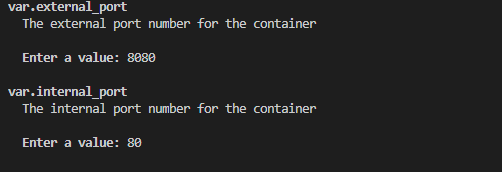

# Variáveis

## Boas práticas:
A variável pode ser definida sem inserir o tipo e descrição, mas por boas práticas usaremos a definição completa.
```bash
variable "image_name" {
  type        = string
  description = "The name of the Docker image"
  default     = "nginx"
}
```
Se não tiver o valor defualt:
```bash
variable "external_port" {
  type        = number
  description = "The external port number for the container"
}
```
O terminal irá pedir para você inserir os valores que estão faltando e são necessário para o sistema:



Ou podemos utilizar o teminal direto para fazer o input dos valores necessário:
```bash
terraform apply -var 'external_port=8080' -var 'internal_port=80'
```


Para facilitar a utilização das variáveis podemos utilizar a "Interpolação de strings" (string interpolation)
```bash
resource "docker_image" "nginx_image" {
  name = "${var.image_name}:${var.image_tag}"
}
```

1. Now go ahead and destroy the environment using the `-destroy` flag which is another way of destroying the environment that is often used in CI/CD pipelines.

```bash
terraform apply -destroy -var 'external_port=8080' -var 'internal_port=80'
```


